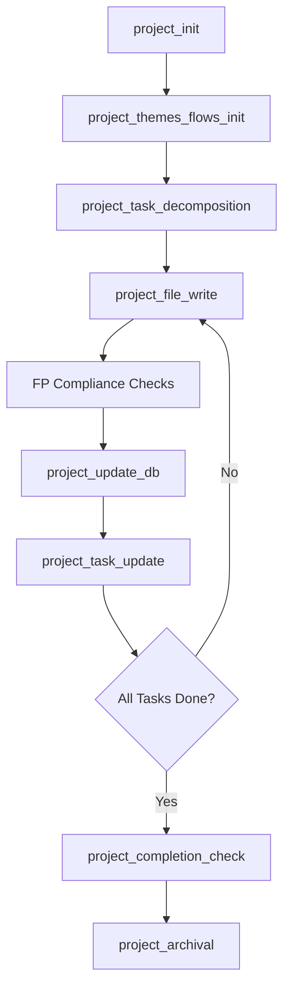

# AIFP: AI Functional Procedural Programming

> **A language-agnostic programming paradigm designed for AI-generated and AI-maintained codebases**

---

## Table of Contents

- [What is AIFP?](#what-is-aifp)
- [Core Principles](#core-principles)
- [Architecture Overview](#architecture-overview)
- [Three-Database System](#three-database-system)
- [How It Works](#how-it-works)
- [Getting Started](#getting-started)
- [Directives System](#directives-system)
- [Project Lifecycle](#project-lifecycle)
- [Example Workflow](#example-workflow)
- [Documentation](#documentation)
- [Design Philosophy](#design-philosophy)
- [License](#license)

---

## What is AIFP?

**AIFP (AI Functional Procedural)** is a programming paradigm that combines:

- **Pure functional programming** principles (referential transparency, immutability, composability)
- **Procedural execution** patterns (explicit sequencing, no hidden state)
- **Database-driven project management** (persistent state, instant context retrieval)
- **Directive-based AI guidance** (deterministic workflows, automated compliance)

### Why AIFP?

Traditional programming paradigms were designed for humans. AIFP is optimized for **AI-human collaboration**:

| Challenge | Traditional Approach | AIFP Solution |
|-----------|---------------------|---------------|
| **Context Loss** | AI forgets between sessions | Database-driven persistent state |
| **OOP Complexity** | Classes, inheritance, polymorphism | Pure functions, explicit data structures |
| **Infinite Development** | Projects never "complete" | Finite completion paths with milestones |
| **Code Reasoning** | Parse source code repeatedly | Pre-indexed functions, dependencies, interactions |
| **Inconsistent Standards** | Style guides, linters, reviews | Immutable directives enforcing compliance |

---

## Core Principles

### 1. Functional-Procedural Hybrid

```python
# ✅ AIFP-Compliant
def calculate_total(items: List[Item]) -> float:
    """Pure function: deterministic, no side effects"""
    return reduce(lambda acc, item: acc + item.price, items, 0.0)

# ❌ Not AIFP-Compliant
class Calculator:
    def __init__(self):
        self.total = 0  # Hidden state

    def add_item(self, item):
        self.total += item.price  # Mutation
```

### 2. Database-Indexed Logic

Every function, file, and dependency is tracked in SQLite:

```sql
-- Instant access to project structure
SELECT f.name, f.purpose, f.purity_level
FROM functions f
JOIN files fi ON f.file_id = fi.id
WHERE fi.path = 'src/calculator.py';
```

### 3. AI-Readable Code

- **Flat structure**: No deep inheritance hierarchies
- **Explicit dependencies**: All parameters passed explicitly
- **Pure functions**: Same inputs → same outputs
- **Metadata annotations**: Machine-readable function headers

### 4. Finite Completion Paths

```
Project: MatrixCalculator
├── Completion Path (3 stages)
│   ├── 1. Setup (completed)
│   ├── 2. Core Development (in progress)
│   │   ├── Milestone: Matrix Operations
│   │   │   ├── Task: Implement multiply
│   │   │   ├── Task: Implement transpose
│   │   │   └── Task: Add validation
│   │   └── Milestone: Vector Operations
│   └── 3. Finalization (pending)
```

### 5. Language-Agnostic

AIFP works with Python, JavaScript, TypeScript, Rust, Go, and more. FP directives adapt to language-specific syntax while maintaining universal standards.

---

## Architecture Overview

```
┌─────────────────────────────────────────────────────┐
│            AI Assistant (Claude, GPT-4, etc.)        │
│  - Receives natural language commands                │
│  - Calls MCP tools                                   │
│  - Generates FP-compliant code                       │
└────────────────────┬────────────────────────────────┘
                     │ MCP Protocol
┌────────────────────▼────────────────────────────────┐
│                 MCP Server                           │
│  - Routes commands via aifp_run                      │
│  - Executes directives (FP + Project + User Pref)    │
│  - Manages three-database connections                │
│  - Provides helper functions                         │
└───┬────────────────────┬─────────────────────────┬──┘
    │                    │                         │
┌───▼──────────────┐ ┌───▼────────────────┐ ┌─────▼─────────────────┐
│  aifp_core.db    │ │  project.db        │ │  user_preferences.db  │
│  (Global,        │ │  (Per-Project,     │ │  (Per-Project,        │
│   Read-Only)     │ │   Mutable)         │ │   Mutable)            │
│                  │ │                    │ │                       │
│ - 60+ FP directs │ │ - Project metadata │ │ - Directive prefs     │
│ - 21 Project     │ │ - Files & funcs    │ │ - User settings       │
│ - 7 User Pref    │ │ - Task hierarchy   │ │ - AI learning log     │
│ - Helper defs    │ │ - Themes & flows   │ │ - Tracking features   │
│ - Code templates │ │ - Completion path  │ │ - Issue reports       │
│ - Standards      │ │ - Runtime notes    │ │ (All opt-in)          │
└──────────────────┘ └────────────────────┘ └───────────────────────┘
```

---

## Three-Database System

### aifp_core.db (Global, Read-Only)

**Location**: `~/.aifp/aifp_core.db`

**Purpose**: Immutable knowledge base containing all AIFP standards, directives, and helper definitions.

**Key Tables**:
- `directives`: All FP, project, and user preference directives (workflows, keywords, thresholds)
- `helper_functions`: Database, file, Git, and FP utilities
- `directives_interactions`: Cross-directive relationships and dependencies
- `categories`: Directive groupings (purity, immutability, task management, etc.)
- `tools`: MCP tool definitions

**Read-Only Philosophy**: This database is version-controlled and immutable once deployed. AI reads from it but never modifies it.

### project.db (Per-Project, Mutable)

**Location**: `<project-root>/.aifp-project/project.db`

**Purpose**: Persistent state for a single AIFP project. Tracks code structure, tasks, and runtime notes.

**Key Tables**:
- `project`: High-level metadata (name, purpose, goals, status)
- `files`, `functions`, `interactions`: Code structure tracking
- `themes`, `flows`: Organizational groupings
- `completion_path`, `milestones`, `tasks`, `subtasks`, `sidequests`: Hierarchical roadmap
- `notes`: Runtime logging with optional directive context (source, severity, directive_name)
- `types`: Algebraic data types (ADTs)
- `infrastructure`: Project setup (language, packages, testing)

**Enhanced Notes**: The `notes` table now includes `source` (user/ai/directive), `directive_name` (optional context), and `severity` (info/warning/error) for better traceability.

### user_preferences.db (Per-Project, Mutable)

**Location**: `<project-root>/.aifp-project/user_preferences.db`

**Purpose**: User-specific AI behavior customizations and opt-in tracking features.

**Key Tables**:
- `directive_preferences`: Per-directive behavior overrides (atomic key-value structure)
- `user_settings`: Project-wide AI behavior settings
- `tracking_settings`: Feature flags for opt-in tracking (all disabled by default)
- `ai_interaction_log`: User corrections and learning data (opt-in)
- `fp_flow_tracking`: FP compliance history (opt-in)
- `issue_reports`: Contextual bug reports (opt-in)

**Cost Management Philosophy**: All tracking features disabled by default to minimize API token usage. Project work should be cost-efficient; debugging and analytics are opt-in.

**User Customization Example**:
```sql
-- User says: "Always add docstrings"
INSERT INTO directive_preferences (directive_name, preference_key, preference_value)
VALUES ('project_file_write', 'always_add_docstrings', 'true');

-- Next file write automatically includes docstrings
```

---

## How It Works

### 1. AIFP MCP Gateway Pattern

The `aifp_run` command serves as a **gateway and reminder**, not an executor. It tells the AI that AIFP directives should be applied.

**Every `aifp_run` call returns**:
```json
{
  "success": true,
  "message": "AIFP MCP available",
  "guidance": {
    "directive_access": "Call get_all_directives() if needed. Call get_directive(name) for specific details.",
    "when_to_use": "Use AIFP directives when coding or when project management action/reaction is needed.",
    "assumption": "Always assume AIFP applies unless user explicitly rejects it.",
    "available_helpers": ["get_all_directives", "get_directive", "get_project_context", "get_project_status"]
  }
}
```

**AI Decision Flow**:
1. User prefixes request with `aifp run` (or AI assumes it)
2. AI calls `aifp_run` tool → receives guidance
3. AI evaluates: Is this coding or project management?
4. If yes: Check if directives are in memory
   - No directives? → Call `get_all_directives()`
   - Has directives? → Apply appropriate ones
5. If no: Respond without directives

### 2. Command Flow Example

```bash
aifp run "Initialize project for calculator"
```

**AI Processing**:
1. Calls `aifp_run` → receives guidance
2. Evaluates: "Project initialization = project management action"
3. Checks memory: "Do I have directives? No."
4. Calls `get_all_directives()` → receives all ~89 directives
5. Reviews directives: "This matches `project_init`"
6. Checks prerequisites: "Should run `project_status` first?"
7. Executes `project_init` directive workflow:
   - Creates `.aifp-project/` directory
   - Initializes `project.db` with schema
   - Inserts project metadata
   - Sets up completion path
8. Returns result to user

### 3. Self-Assessment Framework

Before acting, AI performs self-assessment using questions provided with directives:

**Core Questions**:
1. **Is this coding or project management?**
   - If coding: Apply FP directives for how to write code
   - If project management: Apply project directives for actions/reactions

2. **Do I have directives in memory?**
   - No: Call `get_all_directives()`
   - Yes: Proceed with cached directives

3. **Which directives apply?**
   - FP directives: Code structure, purity, immutability, composition
   - Project directives: File writes, DB updates, task management, compliance

4. **Action-reaction needed?**
   - Code write → FP compliance → DB update
   - File edit → FP validation → DB sync
   - Discussion with decision → DB update

**Example Flow (Coding Task)**:
```
User: "Write multiply_matrices function"
AI thinks:
  ✓ This is coding (FP directives apply)
  ✓ This is project management (project_file_write applies)
  ✓ I have directives in memory
  ✓ Matches: fp_purity, fp_immutability, fp_no_oop, project_file_write
  ✓ Action-reaction: code → FP check → DB update

AI executes:
  1. Write function following FP directives
  2. Verify FP compliance (purity, immutability)
  3. Apply project_file_write directive
  4. Update project.db (files, functions, interactions)
```

### 4. Directive Execution

Directives follow a **trunk → branches → fallback** pattern:

```json
{
  "trunk": "analyze_function",
  "branches": [
    {"if": "pure_function", "then": "mark_compliant"},
    {"if": "mutation_detected", "then": "refactor_to_pure"},
    {"if": "low_confidence", "then": "prompt_user"},
    {"fallback": "prompt_user"}
  ]
}
```

### 5. Cross-Directive Calls

Project directives call FP directives for compliance:

```
project_file_write
  ├─ Calls fp_purity (validates function purity)
  ├─ Calls fp_immutability (checks for mutations)
  ├─ Calls fp_side_effect_detection (isolates I/O)
  └─ If all pass: writes file + updates database
```

---

## Getting Started

### Installation

```bash
# Install AIFP MCP server (global)
pip install aifp-mcp-server

# Initialize AIFP system
aifp init --global

# This creates:
# ~/.aifp/mcp-server/
# ~/.aifp/aifp_core.db
# ~/.aifp/config.json
```

### Project Initialization

```bash
cd /path/to/your/project
aifp init

# This creates:
# .aifp-project/
# .aifp-project/project.db
# .aifp-project/config.json
```

### Configure AI Assistant

Add to Claude Desktop config (`claude_desktop_config.json`):

```json
{
  "mcpServers": {
    "aifp": {
      "command": "aifp",
      "args": ["serve", "--stdio"],
      "env": {
        "AIFP_CONFIG_PATH": "~/.aifp/config.json"
      }
    }
  }
}
```

---

## Directives System

### FP Directives (60+)

Enforce functional programming standards:

| Category | Directives | Purpose |
|----------|------------|---------|
| **Purity** | `fp_purity`, `fp_state_elimination`, `fp_side_effect_detection` | Eliminate hidden state and side effects |
| **Composition** | `fp_monadic_composition`, `fp_function_composition`, `fp_pipelines` | Enable function composition |
| **Error Handling** | `fp_optionals`, `fp_result_types`, `fp_try_monad` | Replace exceptions with Result/Option types |
| **OOP Elimination** | `fp_class_elimination`, `fp_inheritance_block`, `fp_wrapper_generation` | Convert OOP to FP patterns |
| **Optimization** | `fp_memoization`, `fp_lazy_evaluation`, `fp_parallel_evaluation` | Optimize without breaking purity |

### Project Directives (21)

Manage project lifecycle:

| Level | Directives | Purpose |
|-------|------------|---------|
| **Level 0** | `project_init`, `project_run` | Root orchestration |
| **Level 1** | `project_task_decomposition`, `project_themes_flows_init` | High-level coordination |
| **Level 2** | `project_file_write`, `project_update_db`, `project_task_update` | Operational execution |
| **Level 3** | `project_compliance_check`, `project_evolution` | State management |
| **Level 4** | `project_completion_check`, `project_archival` | Validation & completion |

### User Preference Directives (7)

Manage AI behavior customization and learning:

| Directive | Purpose |
|-----------|---------|
| **user_preferences_sync** | Loads preferences before directive execution |
| **user_preferences_update** | Maps user requests to directives, updates preferences |
| **user_preferences_learn** | Learns from user corrections (requires confirmation) |
| **user_preferences_export** | Exports preferences to JSON for backup/sharing |
| **user_preferences_import** | Imports preferences from JSON file |
| **project_notes_log** | Handles logging to project.db with directive context |
| **tracking_toggle** | Enables/disables tracking features with token cost warnings |

---

## Project Lifecycle



---

## Example Workflow

### Create Project

```
User: "Initialize AIFP for my matrix calculator"

AI → aifp_run("Initialize AIFP for my matrix calculator")
    → Receives: AIFP guidance
    → Evaluates: "Project management action"
    → Checks: "No directives in memory"
    → Calls: get_all_directives()
    → Receives: ~89 directives + self-assessment questions
    → Matches: project_init directive
    → Checks: project_status first (no existing project)
    → Executes: project_init workflow
        → Creates .aifp-project/project.db
        → Inserts project metadata
        → Sets up completion path

AI: ✅ Project initialized: MatrixCalculator
    📋 AIFP directives loaded and ready
    Next: Define themes and create first task
```

### Write Function

```
User: "Write multiply_matrices function"

AI → aifp_run("Write multiply_matrices function")
    → Receives: AIFP guidance
    → Evaluates: "Coding task + project management"
    → Checks: "I have directives in memory"
    → Identifies FP directives: fp_purity, fp_immutability, fp_no_oop
    → Identifies project directive: project_file_write
    → Writes function following FP directives
    → Verifies: Pure? Yes. Immutable? Yes. No OOP? Yes.
    → Executes: project_file_write workflow
        → Writes src/matrix.py
        → Updates project.db:
           • files table (new entry)
           • functions table (multiply_matrices)
           • interactions table (dependencies)

AI: ✅ Function written: multiply_matrices
    File: src/matrix.py:15
    FP Compliance: ✓ Pure, immutable, no OOP
    DB Updated: ✓ files, functions, interactions
    Dependencies: validate_dimensions
```

### Check Compliance

```
User: "Check project compliance"

AI → aifp_run("Check project compliance")
    → project_compliance_check directive
    → Queries all functions from project.db
    → Runs FP directives on each
    → Generates report

AI: 📊 Compliance Report:
    Total functions: 12
    Compliant: 10
    Violations: 2
      - calculate_discount (uses global config)
      - process_order (hidden mutation)
```

### Customize AI Behavior

```
User: "Always add docstrings to functions"

AI → aifp_run("Always add docstrings to functions")
    → user_preferences_update directive
        → Calls find_directive_by_intent helper
        → Searches directives by name/description/keywords
        → Finds match: project_file_write
        → Confirms with user: "Apply to file writing?"
        → Updates user_preferences.db

AI: ✅ Preference saved: project_file_write
    Key: always_add_docstrings
    Value: true

    Next file write will include docstrings automatically.
```

### AI Learns from Corrections

```
User: "Actually, use guard clauses instead of nested if statements"

AI → user_preferences_learn directive (detects correction)
    → Logs interaction to ai_interaction_log
    → Infers preference: prefer_guard_clauses = true
    → Prompts user: "Should I remember this preference?"

User: "Yes"

AI: ✅ Preference learned: project_file_write
    Key: prefer_guard_clauses
    Value: true

    I'll use guard clauses in future functions.
```

---

## Documentation

### Comprehensive Blueprints

- **[Project Directives Blueprint](docs/project_directives_blueprint.md)** - Project lifecycle management
- **[FP Directives Blueprint](docs/fp_directives_blueprint.md)** - Functional programming enforcement
- **[MCP Blueprint](docs/mcp_blueprint.md)** - MCP server architecture and tools
- **[Project DB Blueprint](docs/project_db_blueprint.md)** - project.db schema and queries
- **[MCP DB Blueprint](docs/mcp_db_blueprint.md)** - aifp_core.db schema and population
- **[Interactions Blueprint](docs/interactions_blueprint.md)** - Cross-component interactions
- **[Git Blueprint](docs/git_blueprint.md)** - Git integration and external change detection

### Schema Files

- **[schemaExampleMCP.sql](docs/db-schema/schemaExampleMCP.sql)** - Complete aifp_core.db schema
- **[schemaExampleProject.sql](docs/db-schema/schemaExampleProject.sql)** - Complete project.db schema
- **[schemaExampleSettings.sql](docs/db-schema/schemaExampleSettings.sql)** - Complete user_preferences.db schema

### Directive Definitions

- **[FP Core Directives](docs/directives-json/directives-fp-core.json)** - Core FP directives (30)
- **[FP Aux Directives](docs/directives-json/directives-fp-aux.json)** - Auxiliary FP directives (30+)
- **[Project Directives](docs/directives-json/directives-project.json)** - All project directives (22)
- **[User Preference Directives](docs/directives-json/directives-user-pref.json)** - User customization directives (7)

---

## Design Philosophy

### Immutable Rules, Evolving Projects

- **`aifp_core.db`** is the **rulebook** (read-only, global, version-controlled)
- **`project.db`** is the **workspace** (read-write, per-project, runtime state)
- **`user_preferences.db`** is the **customization layer** (read-write, per-project, AI behavior)
- **Directives** define the boundaries; AI operates freely within them

### Database-Driven Context

Traditional AI assistants lack persistent memory. AIFP solves this:

```sql
-- AI remembers everything across sessions
SELECT f.name, f.purpose, f.dependencies_json
FROM functions f
WHERE f.theme = 'authentication';
```

No source code reparsing required. Instant context retrieval.

### Finite by Design

Every AIFP project has a **completion path**:

```
Setup → Core Development → Testing → Documentation → Finalization
```

Once `project_completion_check` passes, the project is **done**. No endless feature creep.

---

## Roadmap

### Current (v1.0)

- ✅ Core directive system (60+ FP, 22 Project, 7 User Preference)
- ✅ Three-database architecture (aifp_core, project, user_preferences)
- ✅ MCP server design with command routing
- ✅ User preference system with directive mapping
- ✅ Git integration (auto-init, external change detection)
- ✅ Complete documentation and blueprints
- ✅ Cost-conscious tracking (all features opt-in by default)

### Planned (v1.1+)

- [ ] MCP server implementation (Python)
- [ ] Directive sync script (`sync-directives.py`)
- [ ] Database migration scripts (`migrate.py`)
- [ ] User preference initialization (`init-user-preferences.py`)
- [ ] Helper function implementations (Python)
- [ ] VS Code extension for task management
- [ ] Directive visualization and analytics
- [ ] Cross-language wrapper generation
- [ ] AI reasoning trace visualization

---

## Contributing

AIFP is an **open standard** for AI-optimized programming. Contributions welcome:

1. **New FP directives** - Language-specific or advanced patterns
2. **Helper functions** - Database, file, Git, or FP utilities
3. **Templates** - ADT boilerplate, error handling patterns
4. **Documentation** - Examples, tutorials, case studies

See [CONTRIBUTING.md](CONTRIBUTING.md) for guidelines.

---

## License

MIT License - See [LICENSE](LICENSE) for details.

---

## Summary

**AIFP transforms AI from a "code generator" into a structured, customizable project collaborator.**

It combines:
- **Pure functional programming** for deterministic, composable code
- **Three-database architecture** for immutable rules, runtime state, and user customization
- **Directive-based workflows** for consistent, automated compliance
- **User preference learning** for AI that adapts to your coding style
- **Finite completion paths** for goal-oriented development
- **Cost-conscious design** with opt-in tracking features

The result: AI-maintained codebases that are **predictable, traceable, customizable, and maintainable** across sessions, teams, and even different AI assistants.

---

**Built for the age of AI-native development.**
