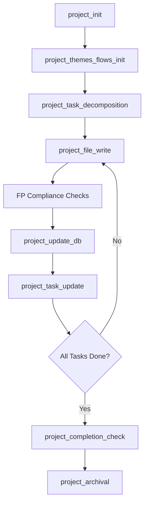

# AIFP: AI Functional Procedural Programming

> **A language-agnostic programming paradigm designed for AI-generated and AI-maintained codebases**

---

## Table of Contents

- [What is AIFP?](#what-is-aifp)
- [Core Principles](#core-principles)
- [Architecture Overview](#architecture-overview)
- [Two-Database System](#two-database-system)
- [How It Works](#how-it-works)
- [Getting Started](#getting-started)
- [Directives System](#directives-system)
- [Project Lifecycle](#project-lifecycle)
- [Example Workflow](#example-workflow)
- [Documentation](#documentation)
- [Design Philosophy](#design-philosophy)
- [License](#license)

---

## What is AIFP?

**AIFP (AI Functional Procedural)** is a programming paradigm that combines:

- **Pure functional programming** principles (referential transparency, immutability, composability)
- **Procedural execution** patterns (explicit sequencing, no hidden state)
- **Database-driven project management** (persistent state, instant context retrieval)
- **Directive-based AI guidance** (deterministic workflows, automated compliance)

### Why AIFP?

Traditional programming paradigms were designed for humans. AIFP is optimized for **AI-human collaboration**:

| Challenge | Traditional Approach | AIFP Solution |
|-----------|---------------------|---------------|
| **Context Loss** | AI forgets between sessions | Database-driven persistent state |
| **OOP Complexity** | Classes, inheritance, polymorphism | Pure functions, explicit data structures |
| **Infinite Development** | Projects never "complete" | Finite completion paths with milestones |
| **Code Reasoning** | Parse source code repeatedly | Pre-indexed functions, dependencies, interactions |
| **Inconsistent Standards** | Style guides, linters, reviews | Immutable directives enforcing compliance |

---

## Core Principles

### 1. Functional-Procedural Hybrid

```python
# ✅ AIFP-Compliant
def calculate_total(items: List[Item]) -> float:
    """Pure function: deterministic, no side effects"""
    return reduce(lambda acc, item: acc + item.price, items, 0.0)

# ❌ Not AIFP-Compliant
class Calculator:
    def __init__(self):
        self.total = 0  # Hidden state

    def add_item(self, item):
        self.total += item.price  # Mutation
```

### 2. Database-Indexed Logic

Every function, file, and dependency is tracked in SQLite:

```sql
-- Instant access to project structure
SELECT f.name, f.purpose, f.purity_level
FROM functions f
JOIN files fi ON f.file_id = fi.id
WHERE fi.path = 'src/calculator.py';
```

### 3. AI-Readable Code

- **Flat structure**: No deep inheritance hierarchies
- **Explicit dependencies**: All parameters passed explicitly
- **Pure functions**: Same inputs → same outputs
- **Metadata annotations**: Machine-readable function headers

### 4. Finite Completion Paths

```
Project: MatrixCalculator
├── Completion Path (3 stages)
│   ├── 1. Setup (completed)
│   ├── 2. Core Development (in progress)
│   │   ├── Milestone: Matrix Operations
│   │   │   ├── Task: Implement multiply
│   │   │   ├── Task: Implement transpose
│   │   │   └── Task: Add validation
│   │   └── Milestone: Vector Operations
│   └── 3. Finalization (pending)
```

### 5. Language-Agnostic

AIFP works with Python, JavaScript, TypeScript, Rust, Go, and more. FP directives adapt to language-specific syntax while maintaining universal standards.

---

## Architecture Overview

```
┌─────────────────────────────────────────────────────┐
│            AI Assistant (Claude, GPT-4, etc.)        │
│  - Receives natural language commands                │
│  - Calls MCP tools                                   │
│  - Generates FP-compliant code                       │
└────────────────────┬────────────────────────────────┘
                     │ MCP Protocol
┌────────────────────▼────────────────────────────────┐
│                 MCP Server                           │
│  - Routes commands via aifp_run                      │
│  - Executes directives (FP + Project)                │
│  - Manages database connections                      │
│  - Provides helper functions                         │
└───┬──────────────────────────────────────────────┬──┘
    │                                              │
┌───▼──────────────────┐            ┌─────────────▼──────────┐
│   aifp_core.db       │            │   project.db           │
│   (Global, Read-Only)│            │   (Per-Project, Mutable)│
│                      │            │                        │
│ - 60+ FP directives  │            │ - Project metadata     │
│ - 21 Project direcs  │            │ - Files & functions    │
│ - Helper definitions │            │ - Task hierarchy       │
│ - Code templates     │            │ - Themes & flows       │
│ - Standards & rules  │            │ - Completion roadmap   │
└──────────────────────┘            └────────────────────────┘
```

---

## Two-Database System

### aifp_core.db (Global, Read-Only)

**Location**: `~/.aifp/aifp_core.db`

**Purpose**: Immutable knowledge base containing all AIFP standards, directives, and helper definitions.

**Key Tables**:
- `directives`: All FP and project directives (workflows, keywords, thresholds)
- `helper_functions`: Database, file, Git, and FP utilities
- `tool_schemas`: MCP tool input/output definitions
- `standards`: Code examples (good vs. bad patterns)
- `templates`: Boilerplate code (ADTs, Result types, etc.)

### project.db (Per-Project, Mutable)

**Location**: `<project-root>/.aifp-project/project.db`

**Purpose**: Persistent state for a single AIFP project.

**Key Tables**:
- `project`: High-level metadata (name, purpose, goals, status)
- `files`, `functions`, `interactions`: Code structure tracking
- `themes`, `flows`: Organizational groupings
- `completion_path`, `milestones`, `tasks`: Roadmap and progress
- `notes`: AI memory and clarifications

---

## How It Works

### 1. Command Flow

```bash
aifp run "Initialize project for calculator"
```

**Processing**:
1. MCP server receives command
2. Queries `aifp_core.db` for intent keywords → matches `project_init`
3. Loads `project_init` directive workflow
4. Executes workflow steps:
   - Creates `.aifp-project/` directory
   - Initializes `project.db` with schema
   - Inserts project metadata
   - Sets up completion path
5. Returns structured result to AI assistant

### 2. Directive Execution

Directives follow a **trunk → branches → fallback** pattern:

```json
{
  "trunk": "analyze_function",
  "branches": [
    {"if": "pure_function", "then": "mark_compliant"},
    {"if": "mutation_detected", "then": "refactor_to_pure"},
    {"if": "low_confidence", "then": "prompt_user"},
    {"fallback": "prompt_user"}
  ]
}
```

### 3. Cross-Directive Calls

Project directives call FP directives for compliance:

```
project_file_write
  ├─ Calls fp_purity (validates function purity)
  ├─ Calls fp_immutability (checks for mutations)
  ├─ Calls fp_side_effect_detection (isolates I/O)
  └─ If all pass: writes file + updates database
```

---

## Getting Started

### Installation

```bash
# Install AIFP MCP server (global)
pip install aifp-mcp-server

# Initialize AIFP system
aifp init --global

# This creates:
# ~/.aifp/mcp-server/
# ~/.aifp/aifp_core.db
# ~/.aifp/config.json
```

### Project Initialization

```bash
cd /path/to/your/project
aifp init

# This creates:
# .aifp-project/
# .aifp-project/project.db
# .aifp-project/config.json
```

### Configure AI Assistant

Add to Claude Desktop config (`claude_desktop_config.json`):

```json
{
  "mcpServers": {
    "aifp": {
      "command": "aifp",
      "args": ["serve", "--stdio"],
      "env": {
        "AIFP_CONFIG_PATH": "~/.aifp/config.json"
      }
    }
  }
}
```

---

## Directives System

### FP Directives (60+)

Enforce functional programming standards:

| Category | Directives | Purpose |
|----------|------------|---------|
| **Purity** | `fp_purity`, `fp_state_elimination`, `fp_side_effect_detection` | Eliminate hidden state and side effects |
| **Composition** | `fp_monadic_composition`, `fp_function_composition`, `fp_pipelines` | Enable function composition |
| **Error Handling** | `fp_optionals`, `fp_result_types`, `fp_try_monad` | Replace exceptions with Result/Option types |
| **OOP Elimination** | `fp_class_elimination`, `fp_inheritance_block`, `fp_wrapper_generation` | Convert OOP to FP patterns |
| **Optimization** | `fp_memoization`, `fp_lazy_evaluation`, `fp_parallel_evaluation` | Optimize without breaking purity |

### Project Directives (21)

Manage project lifecycle:

| Level | Directives | Purpose |
|-------|------------|---------|
| **Level 0** | `project_init`, `project_run` | Root orchestration |
| **Level 1** | `project_task_decomposition`, `project_themes_flows_init` | High-level coordination |
| **Level 2** | `project_file_write`, `project_update_db`, `project_task_update` | Operational execution |
| **Level 3** | `project_compliance_check`, `project_evolution` | State management |
| **Level 4** | `project_completion_check`, `project_archival` | Validation & completion |

---

## Project Lifecycle



---

## Example Workflow

### Create Project

```
User: "Initialize AIFP for my matrix calculator"

AI → aifp_run("Initialize AIFP for my matrix calculator")
    → project_init directive
    → Creates .aifp-project/project.db
    → Inserts project metadata
    → Sets up completion path

AI: ✅ Project initialized: MatrixCalculator
    Next: Define themes and create first task
```

### Write Function

```
User: "Write multiply_matrices function"

AI → aifp_run("Write multiply_matrices function")
    → project_file_write directive
        → Calls fp_purity (validates purity)
        → Calls fp_immutability (checks mutations)
        → Writes src/matrix.py
        → Updates files, functions, interactions tables

AI: ✅ Function written: multiply_matrices
    File: src/matrix.py
    Purity: ✓ Pure
    Dependencies: validate_dimensions
```

### Check Compliance

```
User: "Check project compliance"

AI → aifp_run("Check project compliance")
    → project_compliance_check directive
    → Queries all functions from project.db
    → Runs FP directives on each
    → Generates report

AI: 📊 Compliance Report:
    Total functions: 12
    Compliant: 10
    Violations: 2
      - calculate_discount (uses global config)
      - process_order (hidden mutation)
```

---

## Documentation

### Comprehensive Blueprints

- **[Project Directives Blueprint](docs/project_directives_blueprint.md)** - Project lifecycle management
- **[FP Directives Blueprint](docs/fp_directives_blueprint.md)** - Functional programming enforcement
- **[MCP Blueprint](docs/mcp_blueprint.md)** - MCP server architecture and tools
- **[Project DB Blueprint](docs/project_db_blueprint.md)** - project.db schema and queries
- **[MCP DB Blueprint](docs/mcp_db_blueprint.md)** - aifp_core.db schema and population
- **[Interactions Blueprint](docs/interactions_blueprint.md)** - Cross-component interactions
- **[Git Blueprint](docs/git_blueprint.md)** - Git integration and external change detection

### Schema Files

- **[schemaExampleProject.sql](docs/schemaExampleProject.sql)** - Complete project.db schema
- **[schemaExampleMCP.sql](docs/schemaExampleMCP.sql)** - Complete aifp_core.db schema

### Directive Definitions

- **[FP Core Directives](docs/directives-fp-core.json)** - Core FP directives (20)
- **[FP Aux Directives](docs/directives-fp-aux.json)** - Auxiliary FP directives (40+)
- **[Project Directives](docs/directives-project.json)** - All project directives (21)

---

## Design Philosophy

### Immutable Rules, Evolving Projects

- **`aifp_core.db`** is the **rulebook** (read-only, global, version-controlled)
- **`project.db`** is the **playground** (read-write, per-project, dynamic)
- **Directives** define the boundaries; AI operates freely within them

### Database-Driven Context

Traditional AI assistants lack persistent memory. AIFP solves this:

```sql
-- AI remembers everything across sessions
SELECT f.name, f.purpose, f.dependencies_json
FROM functions f
WHERE f.theme = 'authentication';
```

No source code reparsing required. Instant context retrieval.

### Finite by Design

Every AIFP project has a **completion path**:

```
Setup → Core Development → Testing → Documentation → Finalization
```

Once `project_completion_check` passes, the project is **done**. No endless feature creep.

---

## Roadmap

### Current (v1.0)

- ✅ Core directive system (60+ FP, 21 Project)
- ✅ Two-database architecture
- ✅ MCP server with command routing
- ✅ Git integration (auto-init, external change detection)
- ✅ Complete documentation and blueprints

### Planned (v1.1+)

- [ ] MCP server implementation (Python)
- [ ] Directive sync script (`populate_core_db.py`)
- [ ] VS Code extension for task management
- [ ] Directive visualization and analytics
- [ ] Cross-language wrapper generation
- [ ] AI reasoning trace visualization

---

## Contributing

AIFP is an **open standard** for AI-optimized programming. Contributions welcome:

1. **New FP directives** - Language-specific or advanced patterns
2. **Helper functions** - Database, file, Git, or FP utilities
3. **Templates** - ADT boilerplate, error handling patterns
4. **Documentation** - Examples, tutorials, case studies

See [CONTRIBUTING.md](CONTRIBUTING.md) for guidelines.

---

## License

MIT License - See [LICENSE](LICENSE) for details.

---

## Summary

**AIFP transforms AI from a "code generator" into a structured project collaborator.**

It combines:
- **Pure functional programming** for deterministic, composable code
- **Database-driven state** for persistent AI memory
- **Directive-based workflows** for consistent, automated compliance
- **Finite completion paths** for goal-oriented development

The result: AI-maintained codebases that are **predictable, traceable, and maintainable** across sessions, teams, and even different AI assistants.

---

**Built for the age of AI-native development.**
