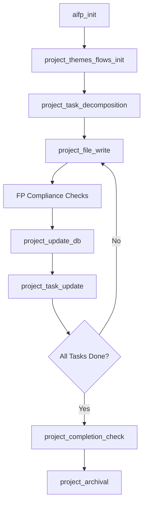

# AIFP: AI Functional Procedural Programming

> **A language-agnostic programming paradigm designed for AI-generated and AI-maintained codebases**

---

## Table of Contents

- [What is AIFP?](#what-is-aifp)
- [Core Principles](#core-principles)
- [Architecture Overview](#architecture-overview)
- [Database Architecture](#database-architecture)
- [How It Works](#how-it-works)
- [Getting Started](#getting-started)
- [Directives System](#directives-system)
- [Project Lifecycle](#project-lifecycle)
- [Example Workflow](#example-workflow)
- [Documentation](#documentation)
- [Development](#development)
- [Design Philosophy](#design-philosophy)
- [Features](#features)
- [Usage Examples](#usage-examples)
- [Privacy Policy](#privacy-policy)
- [Support](#support)
- [License](#license)

---

## What is AIFP?

**AIFP (AI Functional Procedural)** is a programming paradigm that combines:

- **Pure functional programming** principles (referential transparency, immutability, composability)
- **Procedural execution** patterns (explicit sequencing, no hidden state)
- **Database-driven project management** (persistent state, instant context retrieval)
- **Directive-based AI guidance** (deterministic workflows, automated compliance)

### Two Ways to Use AIFP

**Use Case 1: Regular Software Development**
- Build applications (web apps, libraries, CLI tools, etc.)
- AIFP enforces FP compliance and manages your project
- You write code, AI assists with FP standards and project tracking
- Example: Building a web server, calculator library, data processor

**Use Case 2: Custom Directive Automation**
- Define automation rules (home automation, cloud management, workflows)
- **AIFP generates and manages the automation codebase for you**
- You write directive definitions (YAML/JSON/TXT), AI generates the implementation
- The project's code IS the automation code generated from your directives
- Example: Smart home control system, AWS infrastructure manager, workflow automator

**Key Principle**: One AIFP instance per project directory. You would NOT mix a web app with home automation directives. Run separate instances for separate purposes.

### Why AIFP?

Traditional programming paradigms were designed for humans. AIFP is optimized for **AI-human collaboration**:

| Challenge | Traditional Approach | AIFP Solution |
|-----------|---------------------|---------------|
| **Context Loss** | AI forgets between sessions | Database-driven persistent state |
| **OOP Complexity** | Classes, inheritance, polymorphism | Pure functions, explicit data structures |
| **Infinite Development** | Projects never "complete" | Finite completion paths with milestones |
| **Code Reasoning** | Parse source code repeatedly | Pre-indexed functions, dependencies, interactions |
| **Inconsistent Standards** | Style guides, linters, reviews | Immutable directives enforcing compliance |

---

## Core Principles

### 1. Functional-Procedural Hybrid

```python
# ✅ AIFP-Compliant
def calculate_total(items: List[Item]) -> float:
    """Pure function: deterministic, no side effects"""
    return reduce(lambda acc, item: acc + item.price, items, 0.0)

# ❌ Not AIFP-Compliant
class Calculator:
    def __init__(self):
        self.total = 0  # Hidden state

    def add_item(self, item):
        self.total += item.price  # Mutation
```

### 2. Database-Indexed Logic

Every function, file, and dependency is tracked in SQLite:

```sql
-- Instant access to project structure
SELECT f.name, f.purpose, f.purity_level
FROM functions f
JOIN files fi ON f.file_id = fi.id
WHERE fi.path = 'src/calculator.py';
```

### 3. AI-Readable Code

- **Flat structure**: No deep inheritance hierarchies
- **Explicit dependencies**: All parameters passed explicitly
- **Pure functions**: Same inputs → same outputs
- **Metadata annotations**: Machine-readable function headers

### 4. Finite Completion Paths

```
Project: MatrixCalculator
├── Completion Path (3 stages)
│   ├── 1. Setup (completed)
│   ├── 2. Core Development (in progress)
│   │   ├── Milestone: Matrix Operations
│   │   │   ├── Task: Implement multiply
│   │   │   ├── Task: Implement transpose
│   │   │   └── Task: Add validation
│   │   └── Milestone: Vector Operations
│   └── 3. Finalization (pending)
```

### 5. Language-Agnostic

AIFP works with Python, JavaScript, TypeScript, Rust, Go, and more. FP directives adapt to language-specific syntax while maintaining universal standards.

---

## Architecture Overview

```
┌─────────────────────────────────────────────────────┐
│            AI Assistant (Claude, GPT-4, etc.)        │
│  - Receives natural language commands                │
│  - Calls MCP tools                                   │
│  - Generates FP-compliant code                       │
└────────────────────┬────────────────────────────────┘
                     │ MCP Protocol
┌────────────────────▼────────────────────────────────┐
│                 MCP Server                           │
│  - Routes commands via aifp_run                      │
│  - Executes directives (FP + Project + User Pref)    │
│  - Manages four-database connections                 │
│  - Provides helper functions                         │
└───┬────────────────────┬─────────────────────────┬──┘
    │                    │                         │
┌───▼──────────────┐ ┌───▼────────────────┐ ┌─────▼─────────────────┐ ┌──────▼────────────────┐
│  aifp_core.db    │ │  project.db        │ │  user_preferences.db  │ │  user_directives.db   │
│  (Global,        │ │  (Per-Project,     │ │  (Per-Project,        │ │  (Per-Project,        │
│   Read-Only)     │ │   Mutable)         │ │   Mutable)            │ │   Optional)           │
│                  │ │                    │ │                       │ │                       │
│ - FP directives  │ │ - Project metadata │ │ - Directive prefs     │ │ - User directives     │
│ - Project mgmt   │ │ - Files & funcs    │ │ - User settings       │ │ - Execution stats     │
│ - User prefs     │ │ - Task hierarchy   │ │ - AI learning log     │ │ - Dependencies        │
│ - User systems   │ │ - Themes & flows   │ │ - Tracking features   │ │ - Generated code refs │
│ - Helper defs    │ │ - Completion path  │ │ (All opt-in)          │ │ - Source file tracking│
│ - Directive flow │ │ - Runtime notes    │ │                       │ │ (Logs in files)       │
└──────────────────┘ └────────────────────┘ └───────────────────────┘ └───────────────────────┘
```

---

## Database Architecture

### aifp_core.db (Global, Read-Only)

**Location**: Within MCP server installation directory (user-defined location, configured in AI client)

**Purpose**: Immutable knowledge base containing all AIFP standards, directives, and helper definitions.

**Key Tables**:
- `directives`: All FP, project, and user preference directives (workflows, keywords, thresholds)
- `helper_functions`: Database, file, Git, and FP utilities organized across multiple registry files
- `directive_helpers`: **Many-to-many junction table** mapping directives to their helper functions with execution metadata
- `directives_interactions`: Cross-directive relationships and dependencies
- `categories`: Directive groupings (purity, immutability, task management, etc.)
- `tools`: MCP tool definitions

**Helper-Directive Relationship** (New in v1.4):
- One directive can use many helpers, one helper can serve many directives
- Junction table stores: execution context, sequence order, parameter mappings
- Enables flexible helper reuse and clear execution flow
- Defined in `directive_helpers` junction table in `aifp_core.db`

**Helper Classification** (New in v1.4):
- `is_tool = TRUE`: Exposed as MCP tool (AI can call directly via MCP)
- `is_sub_helper = TRUE`: Sub-helper (only called by other helpers, no directive mapping)
- Both FALSE: Helper used by directives (AI calls via directive workflows)

**Helper Registry** (Development Staging):
- Helper definitions maintained in `docs/helpers/json/*.json` during development
- Developers modify JSON files, then import to database when complete
- Each helper includes `used_by_directives` field for relationship mapping
- Database import script populates `aifp_core.db` from JSON files before release
- Production: Users query `aifp_core.db` (pre-populated), NOT JSON files
- JSON files are dev-only staging area, never shipped with package

**Read-Only Philosophy**: This database is version-controlled and immutable once deployed. AI reads from it but never modifies it.

### project.db (Per-Project, Mutable)

**Location**: `<project-root>/.aifp-project/project.db`

**Purpose**: Persistent state for a single AIFP project. Tracks code structure, tasks, and runtime notes.

**Key Tables**:
- `project`: High-level metadata (name, purpose, goals, status, user_directives_status, last_known_git_hash)
- `files`, `functions`, `interactions`: Code structure tracking
- `themes`, `flows`: Organizational groupings
- `completion_path`, `milestones`, `tasks`, `subtasks`, `sidequests`: Hierarchical roadmap
- `notes`: Runtime logging with optional directive context (source, severity, directive_name)
- `types`: Algebraic data types (ADTs)
- `infrastructure`: Project setup (language, packages, testing)
- `work_branches`: Git collaboration metadata (user, purpose, merge strategy)
- `merge_history`: FP-powered merge conflict resolution audit trail

**User Directives Integration**: The `project.user_directives_status` field tracks whether user directives are initialized (NULL/in_progress/active/disabled), allowing `aifp_run` and `aifp_status` directives to include user directive context when active.

**Enhanced Notes**: The `notes` table now includes `source` (user/ai/directive), `directive_name` (optional context), and `severity` (info/warning/error) for better traceability.

### user_preferences.db (Per-Project, Mutable)

**Location**: `<project-root>/.aifp-project/user_preferences.db`

**Purpose**: User-specific AI behavior customizations and opt-in tracking features.

**Key Tables**:
- `directive_preferences`: Per-directive behavior overrides (atomic key-value structure)
- `user_settings`: Project-wide AI behavior settings
- `tracking_settings`: Feature flags for opt-in tracking (all disabled by default)
- `ai_interaction_log`: User corrections and learning data (opt-in)
- `fp_flow_tracking`: FP compliance history (opt-in)
- `issue_reports`: Contextual bug reports (opt-in)

**Cost Management Philosophy**: All tracking features disabled by default to minimize API token usage. Project work should be cost-efficient; debugging and analytics are opt-in.

**User Customization Example**:
```sql
-- User says: "Always add docstrings"
INSERT INTO directive_preferences (directive_name, preference_key, preference_value)
VALUES ('project_file_write', 'always_add_docstrings', 'true');

-- Next file write automatically includes docstrings
```

### user_directives.db (Per-Project, Optional)

**Location**: `<project-root>/.aifp-project/user_directives.db`

**Purpose**: Store user-defined domain-specific directives for automation (home automation, cloud infrastructure, etc.). **When this database exists, the AIFP project IS dedicated to building and managing the automation code generated from these directives.**

This database only exists in **Use Case 2: Custom Directive Automation** projects. In regular software development projects, this database is not created.

**Key Tables**:
- `user_directives`: Directive definitions (triggers, actions, status, validated configuration)
- `directive_executions`: Execution statistics (summary only, detailed logs in files)
- `directive_dependencies`: Required packages, APIs, environment variables
- `directive_implementations`: Links directives to generated code files
- `helper_functions`: **AI-generated helper functions** (project-specific implementation utilities)
- `directive_helpers`: **Many-to-many junction table** mapping user directives to their helpers
- `source_files`: Tracks user directive source files (YAML/JSON/TXT)
- `logging_config`: File-based logging configuration

**Helper Functions (New in v1.0)**:
- AI generates project-specific helper functions for user directives
- Tracked with implementation status: not_implemented → generated → tested → approved
- Enforces FP compliance (pure functions) for all generated code
- Same many-to-many relationship pattern as aifp_core.db

**File-Based Logging Philosophy**: Database stores state and statistics only. Detailed execution logs (30-day retention) and error logs (90-day retention) are stored in rotating files at `.aifp-project/logs/`.

**Directory Structure Comparison**:

```
# Use Case 1: Regular Software Development
my-web-app/
├── src/                    # Your application code
├── tests/                  # Your tests
└── .aifp-project/          # AIFP tracks your application
    ├── project.db
    └── user_preferences.db

# Use Case 2: Custom Directive Automation
home-automation/
├── directives/             # ← User writes directive files here
│   ├── lights.yaml
│   └── security.yaml
├── src/                    # ← AIFP GENERATES this code
│   ├── lights_controller.py
│   └── security_monitor.py
├── tests/                  # ← AIFP GENERATES tests
└── .aifp-project/          # ← AI-managed only, user never touches
    ├── project.db          # Tracks generated src/ code
    ├── user_preferences.db
    ├── user_directives.db  # References ../directives/ files
    └── logs/               # 30/90-day execution logs
```

**Example Workflow (Automation Project)**:
1. User creates `directives/lights.yaml` in their project
2. User tells AI: "Parse my directive file at directives/lights.yaml"
3. AI parses and validates through interactive Q&A
4. AI generates FP-compliant implementation code in `src/`
5. AI tracks generated code in `project.db` (files, functions, tasks)
6. Directives execute in real-time via background services
7. Execution logs to `.aifp-project/logs/`, statistics to database

**Note**: User directive files stay in the user's project. `.aifp-project/` is AI-managed metadata.

---

## How It Works

### 1. AIFP MCP Gateway Pattern

The `aifp_run` command serves as a **gateway and reminder**, not an executor. It tells the AI that AIFP directives should be applied.

**Every `aifp_run` call returns**:
```json
{
  "success": true,
  "message": "AIFP MCP available",
  "guidance": {
    "directive_access": "Directive names cached from session bundle. Query specific directives by name when needed.",
    "when_to_use": "Use AIFP directives when coding or when project management action/reaction is needed.",
    "assumption": "Always assume AIFP applies unless user explicitly rejects it."
  }
}
```

The MCP server exposes CRUD helper functions for all database operations — tracking files, functions, tasks, project state, user preferences, and (for Use Case 2) automation directives. AI discovers available helpers from the database at runtime.

**AI Decision Flow**:
1. User prefixes request with `aifp run` (or AI assumes it)
2. AI calls `aifp_run` tool → receives guidance
3. AI evaluates: Is this coding or project management?
4. If yes: Check if directives are in memory
   - No directives? → Call `get_all_directives()`
   - Has directives? → Apply appropriate ones
5. If no: Respond without directives

### 2. Command Flow Example

```bash
aifp run "Initialize project for calculator"
```

**AI Processing**:
1. Calls `aifp_run` → receives guidance
2. Evaluates: "Project initialization = project management action"
3. Checks memory: "Do I have directives? No."
4. Calls directive loading → receives comprehensive directive library
5. Reviews directives: "This matches `aifp_init`"
6. Checks prerequisites: "Should run `project_status` first?"
7. Executes `aifp_init` directive workflow:
   - Creates `.aifp-project/` directory
   - Initializes `project.db` with schema
   - Inserts project metadata
   - Sets up completion path
8. Returns result to user

### 3. Self-Assessment Framework

Before acting, AI performs self-assessment using questions provided with directives:

**Core Questions**:
1. **Is this coding or project management?**
   - If coding: Apply FP directives for how to write code
   - If project management: Apply project directives for actions/reactions

2. **Do I have directives in memory?**
   - No: Call `get_all_directives()`
   - Yes: Proceed with cached directives

3. **Which directives apply?**
   - FP baseline: Code structure, purity, immutability, composition (always active)
   - Project directives: File writes, DB updates, task management

4. **Action-reaction needed?**
   - Code write → FP compliance → DB update
   - File edit → FP validation → DB sync
   - Discussion with decision → DB update

**Example Flow (Coding Task)**:
```
User: "Write multiply_matrices function"
AI thinks:
  ✓ This is coding (FP baseline applies)
  ✓ This is project management (project_file_write applies)
  ✓ I have directives in memory
  ✓ Matches: project_file_write directive
  ✓ Action-reaction: code → FP check → DB update

AI executes:
  1. Write function following FP baseline
  2. Verify FP compliance (purity, immutability)
  3. Apply project_file_write directive
  4. Update project.db (files, functions, interactions)
```

### 4. Directive Execution

Directives follow a **trunk → branches → fallback** pattern:

```json
{
  "trunk": "analyze_function",
  "branches": [
    {"if": "pure_function", "then": "mark_compliant"},
    {"if": "mutation_detected", "then": "refactor_to_pure"},
    {"if": "low_confidence", "then": "prompt_user"},
    {"fallback": "prompt_user"}
  ]
}
```

### 5. Cross-Directive Calls

Project directives call FP directives for compliance:

```
project_file_write
  ├─ Calls fp_purity (validates function purity)
  ├─ Calls fp_immutability (checks for mutations)
  ├─ Calls fp_side_effect_detection (isolates I/O)
  └─ If all pass: writes file + updates database
```

---

## Getting Started

### Prerequisites

- **Python 3.11+** (required for type hint syntax used throughout)

### Installation

#### Method 1: pip install (Recommended)

```bash
pip install aifp
```

This installs the MCP server and makes the `aifp` command available. AIFP has zero required external dependencies — the server is pure Python stdlib.

#### Method 2: Manual Install (GitHub Download)

1. **Download** the repository (zip download or `git clone`)
2. **Locate** the `src/aifp/` folder — this is the complete MCP server package
3. **Copy** the `aifp/` folder to wherever you keep MCP servers:
   ```bash
   # Example: copy to your MCP servers directory
   cp -r src/aifp/ ~/mcp-servers/aifp/
   ```

No additional dependencies to install. The `aifp/` folder contains everything the server needs: helper functions, directives, database schemas, and the pre-populated `aifp_core.db`.

### Add the System Prompt to Your AI Client

**This step is required.** The system prompt is what tells the AI to use AIFP tools proactively. Without it, the MCP server is just a collection of passive tools that never get called.

**pip install users** — print the system prompt to your terminal, then copy-paste it:

```bash
aifp --system-prompt
# or: python -m aifp --system-prompt
```

**Manual install users** — find the system prompt file in the downloaded repository:

```
sys-prompt/aifp_system_prompt.txt
```

Open it and copy its contents.

**Where to paste it** (depends on your AI client):

| AI Client | Where to Add System Prompt |
|-----------|---------------------------|
| **Claude Desktop** | Settings → Custom Instructions |
| **Claude Code** | Add to `CLAUDE.md` in your project root |
| **Other MCP clients** | System prompt / custom instructions field |

### Configure Your AI Client

Register the AIFP MCP server in your AI client's configuration.

**Claude Desktop** — edit `claude_desktop_config.json`:

```json
{
  "mcpServers": {
    "aifp": {
      "command": "python3",
      "args": ["-m", "aifp"],
      "env": {}
    }
  }
}
```

If you used **Method 2 (manual install)**, add the parent directory of your `aifp/` folder to `PYTHONPATH` so Python can find it:

```json
{
  "mcpServers": {
    "aifp": {
      "command": "python3",
      "args": ["-m", "aifp"],
      "env": {
        "PYTHONPATH": "/path/to/parent-of-aifp-folder"
      }
    }
  }
}
```

For example, if you copied `aifp/` to `~/mcp-servers/aifp/`, set `PYTHONPATH` to `~/mcp-servers`.

**Claude Code** — add to your MCP settings (`.mcp.json` or via settings UI) with the same command pattern above.

**Other MCP Clients** — the server uses **stdio transport**. Point your client at `python3 -m aifp`. For manual installs, ensure `PYTHONPATH` includes the parent directory of the `aifp/` folder.

### How It Works

The server communicates over stdio using the Model Context Protocol. It resolves `aifp_core.db` (the directive database) relative to its own installation — no environment variables needed.

Once connected, the AI calls `aifp_run()` on every interaction (guided by the system prompt). Project state is stored in `.aifp-project/` in your working directory, created automatically when you initialize a project.

### Project Initialization

Tell your AI assistant:

```
"Initialize AIFP for my project"
```

The AI calls `aifp_init` which creates an `.aifp-project/` folder in your project root containing databases for project state tracking, user preferences, and a ProjectBlueprint document. You don't need to interact with these files — the MCP server manages them automatically.

---

## Directives System

### FP Baseline vs FP Directives

**FP Baseline** (Always Active):
- Core functional programming rules AI follows naturally when writing code
- Pure functions, immutability, no OOP, explicit error handling
- Non-negotiable - all code must be FP-compliant

**FP Directives** (Reference Documentation):
- Detailed guidance for complex scenarios and edge cases
- Consulted only when AI is uncertain about implementation
- Categories: Purity, Composition, Error Handling, OOP Elimination, Optimization
- Examples: `fp_purity`, `fp_monadic_composition`, `fp_result_types`, `fp_wrapper_generation`

### Project Directives

Manage project lifecycle:

| Level | Directives | Purpose |
|-------|------------|---------|
| **Level 0** | `aifp_run` | Gateway orchestration (every interaction) |
| **Level 1** | `aifp_status`, `aifp_init`, `project_task_decomposition` | Status, initialization, high-level coordination |
| **Level 2** | `project_file_write`, `project_update_db`, `project_task_update` | Operational execution |
| **Level 3** | `project_compliance_check`, `project_evolution` | State management |
| **Level 4** | `project_completion_check`, `project_archive` | Validation & completion |

### User Preference Directives

Manage AI behavior customization and learning:

| Directive | Purpose |
|-----------|---------|
| **user_preferences_sync** | Loads preferences before directive execution |
| **user_preferences_update** | Maps user requests to directives, updates preferences |
| **user_preferences_learn** | Learns from user corrections (requires confirmation) |
| **user_preferences_export** | Exports preferences to JSON for backup/sharing |
| **user_preferences_import** | Imports preferences from JSON file |
| **project_notes_log** | Handles logging to project.db with directive context |
| **tracking_toggle** | Enables/disables tracking features with token cost warnings |

### User-Defined Directives

**FOR USE CASE 2 ONLY**: Automation projects where AIFP generates and manages the codebase:

| Directive | Purpose |
|-----------|---------|
| **user_directive_parse** | Parse YAML/JSON/TXT directive files and extract structured directives |
| **user_directive_validate** | Validate directives through interactive Q&A to resolve ambiguities |
| **user_directive_implement** | **Generate FP-compliant implementation code in `src/`** |
| **user_directive_approve** | User testing and approval workflow before activation |
| **user_directive_activate** | Deploy and activate directives for real-time execution |
| **user_directive_monitor** | Track execution statistics and handle errors |
| **user_directive_update** | Handle changes to directive source files (re-parse, re-validate) |
| **user_directive_deactivate** | Stop execution and clean up resources |
| **user_directive_status** | Comprehensive status reporting for all user directives |

**Use Cases** (Automation Projects):
- **Home Automation**: "At 5pm turn off living room lights", "If stove on > 20 min, turn off"
- **Cloud Infrastructure**: "Scale EC2 when CPU > 80%", "Backup RDS nightly at 1am"
- **Custom Workflows**: "Every Monday generate report", "Process uploaded files automatically"

**Key Architecture**:
- User writes directive definitions (YAML/JSON/TXT)
- **AIFP generates the entire automation codebase** (`src/`, `tests/`, etc.)
- AIFP manages the generated code like any software project (tasks, files, functions)
- Directives execute via background services/schedulers
- Project.db tracks the generated code; user_directives.db tracks directive state

**Key Features**:
- Write directives in YAML, JSON, or plain text
- AI validates through interactive Q&A
- AI generates complete FP-compliant Python modules in `src/`
- AI creates tests for generated code
- Real-time execution via background services
- File-based logging (30-day execution logs, 90-day error logs)
- Dependency management with user confirmation

**Example Directive Definition**:
```yaml
# directives/home_automation.yaml (user creates this in their project)
directives:
  - name: turn_off_lights_5pm
    trigger:
      type: time
      time: "17:00"
      timezone: America/New_York
    action:
      type: api_call
      api: homeassistant
      endpoint: /services/light/turn_off
      params:
        entity_id: group.living_room_lights
```

**User tells AI**: "Parse my directive file at directives/home_automation.yaml"

**AI Generates** (in `src/lights_controller.py`):
```python
# Auto-generated from home_automation.yaml
from typing import Result
from homeassistant_client import HomeAssistant

def turn_off_living_room_lights(ha_client: HomeAssistant) -> Result[None, str]:
    """Turn off all lights in living room group."""
    # FP-compliant implementation
    ...
```

See the directive MD files in `src/aifp/reference/directives/` for complete workflow documentation.

### Git Integration

FP-powered Git collaboration for multi-user and multi-AI development:

| Directive | Purpose |
|-----------|---------|
| **git_init** | Initialize or integrate with Git repository for version control |
| **git_detect_external_changes** | Detect code modifications made outside AIFP sessions |
| **git_create_branch** | Create user/AI work branches (`aifp-{user}-{number}`) |
| **git_detect_conflicts** | FP-powered conflict analysis before merging |
| **git_merge_branch** | Merge branches with AI-assisted conflict resolution |
| **git_sync_state** | Synchronize Git hash with project.db for external change detection |

**Key Features**:
- **Multi-user collaboration**: Multiple developers and AI instances work simultaneously
- **FP-powered conflict resolution**: Uses purity levels, dependencies, and test results to auto-resolve conflicts
- **Branch naming**: `aifp-alice-001`, `aifp-bob-002`, `aifp-ai-claude-001`
- **Auto-resolution**: High-confidence conflicts (>0.8) resolved automatically using FP purity rules
- **External change detection**: Compares Git HEAD with stored hash to detect changes made outside AIFP
- **Simplified schema**: No separate git_state table - Git commands are fast enough (~1ms)

**Why AIFP + Git is Superior to OOP + Git**:

| OOP Merge Problem | AIFP FP Solution |
|-------------------|------------------|
| Class hierarchies conflict | ✅ No classes → No hierarchy conflicts |
| Hidden state changes | ✅ Pure functions → Explicit inputs/outputs |
| Side effects everywhere | ✅ Side effects isolated → Easy to identify conflicts |
| Hard to test both versions | ✅ Pure functions → Easy to test and compare |

**Example Conflict Resolution**:
```
Alice and Bob both modify calculate_total():

Alice's version:
- Purity: ✅ Pure function
- Tests: 10/10 passing

Bob's version:
- Purity: ✅ Pure function
- Tests: 12/12 passing (includes edge cases)

AI Recommendation: Keep Bob's version (confidence: 85%)
Reason: More comprehensive tests, still pure
```

See the Git directive MD files in `src/aifp/reference/directives/` for complete multi-user collaboration workflows.

---

## Project Lifecycle



---

## Example Workflow

### Create Project

```
User: "Initialize AIFP for my matrix calculator"

AI → aifp_run("Initialize AIFP for my matrix calculator")
    → Receives: AIFP guidance
    → Evaluates: "Project management action"
    → Checks: "No directives in memory"
    → Calls: get_all_directives()
    → Receives: Complete directive library + self-assessment questions
    → Matches: aifp_init directive
    → Checks: project_status first (no existing project)
    → Executes: aifp_init workflow
        → Creates .aifp-project/project.db
        → Inserts project metadata
        → Sets up completion path

AI: ✅ Project initialized: MatrixCalculator
    📋 AIFP directives loaded and ready
    Next: Define themes and create first task
```

### Write Function

```
User: "Write multiply_matrices function"

AI → aifp_run("Write multiply_matrices function")
    → Receives: AIFP guidance
    → Evaluates: "Coding task + project management"
    → Checks: "I have directives in memory"
    → Identifies FP directives: fp_purity, fp_immutability, fp_no_oop
    → Identifies project directive: project_file_write
    → Writes function following FP directives
    → Verifies: Pure? Yes. Immutable? Yes. No OOP? Yes.
    → Executes: project_file_write workflow
        → Writes src/matrix.py
        → Updates project.db:
           • files table (new entry)
           • functions table (multiply_matrices)
           • interactions table (dependencies)

AI: ✅ Function written: multiply_matrices
    File: src/matrix.py:15
    FP Compliance: ✓ Pure, immutable, no OOP
    DB Updated: ✓ files, functions, interactions
    Dependencies: validate_dimensions
```

### Check Compliance

```
User: "Check project compliance"

AI → aifp_run("Check project compliance")
    → project_compliance_check directive
    → Queries all functions from project.db
    → Runs FP directives on each
    → Generates report

AI: 📊 Compliance Report:
    Total functions: 12
    Compliant: 10
    Violations: 2
      - calculate_discount (uses global config)
      - process_order (hidden mutation)
```

### Customize AI Behavior

```
User: "Always add docstrings to functions"

AI → aifp_run("Always add docstrings to functions")
    → user_preferences_update directive
        → Calls find_directive_by_intent helper
        → Searches directives by name/description/keywords
        → Finds match: project_file_write
        → Confirms with user: "Apply to file writing?"
        → Updates user_preferences.db

AI: ✅ Preference saved: project_file_write
    Key: always_add_docstrings
    Value: true

    Next file write will include docstrings automatically.
```

### AI Learns from Corrections

```
User: "Actually, use guard clauses instead of nested if statements"

AI → user_preferences_learn directive (detects correction)
    → Logs interaction to ai_interaction_log
    → Infers preference: prefer_guard_clauses = true
    → Prompts user: "Should I remember this preference?"

User: "Yes"

AI: ✅ Preference learned: project_file_write
    Key: prefer_guard_clauses
    Value: true

    I'll use guard clauses in future functions.
```

---

## Documentation

### Directive Reference

All directive documentation is shipped with the package at **[src/aifp/reference/directives/](src/aifp/reference/directives/)** — 129 MD files covering every directive. Each file includes: purpose, when to apply, complete workflows (trunk → branches), compliant/non-compliant examples, edge cases, related directives, helper functions used, and database operations.

### Database Schemas

Schema SQL files are in the package at `src/aifp/database/schemas/`:
- `aifp_core.sql` — Global read-only database (directives, helpers, flows)
- `project.sql` — Per-project mutable database (files, functions, tasks, milestones)
- `user_preferences.sql` — Per-project user customization database
- `user_directives.sql` — Per-project automation directives (Use Case 2 only)

---

## Development

### Dev Directory (`dev/`)

The `dev/` directory contains the **source of truth** for directive and helper function definitions. These JSON files are the canonical definitions that get imported into `aifp_core.db` before release.

```
dev/
├── directives-json/              # Directive definitions (source of truth)
│   ├── directives-fp-core.json   # Core FP directives
│   ├── directives-fp-aux.json    # Auxiliary FP directives
│   ├── directives-project.json   # Project lifecycle directives
│   ├── directives-user-pref.json # User preference directives
│   ├── directives-user-system.json # User automation directives
│   ├── directives-git.json       # Git collaboration directives
│   ├── directive_flow_fp.json    # FP directive flow transitions
│   ├── directive_flow_project.json # Project directive flow transitions
│   └── directive_flow_user_preferences.json # User pref flow transitions
├── helpers-json/                 # Helper function definitions (source of truth)
│   ├── helpers-core.json         # Core/directive helpers
│   ├── helpers-orchestrators.json # Entry point and status helpers
│   ├── helpers-project-*.json    # Project management helpers (9 files)
│   ├── helpers-settings.json     # User preference helpers
│   ├── helpers-user-custom.json  # User directive helpers
│   ├── helpers-git.json          # Git operation helpers
│   └── helpers-index.json        # Shared/global helpers
├── sync-directives.py            # Imports JSON → aifp_core.db
└── logs/                         # Development logs
```

**Dev workflow**: Modify JSON files in `dev/` → run `sync-directives.py` to rebuild `aifp_core.db` → test → release. End users only interact with the pre-populated `aifp_core.db`, never the JSON files directly.

---

## Design Philosophy

### Immutable Rules, Evolving Projects

- **`aifp_core.db`** is the **rulebook** (read-only, global, version-controlled)
- **`project.db`** is the **workspace** (read-write, per-project, runtime state)
- **`user_preferences.db`** is the **customization layer** (read-write, per-project, AI behavior)
- **Directives** define the boundaries; AI operates freely within them

### Database-Driven Context

Traditional AI assistants lack persistent memory. AIFP solves this:

```sql
-- AI remembers everything across sessions
SELECT f.name, f.purpose, f.dependencies_json
FROM functions f
WHERE f.theme = 'authentication';
```

No source code reparsing required. Instant context retrieval.

### Finite by Design

Every AIFP project has a **completion path**:

```
Setup → Core Development → Testing → Documentation → Finalization
```

Once `project_completion_check` passes, the project is **done**. No endless feature creep.

---

## Features

- **207 MCP tools** — Full CRUD for 4 SQLite databases, covering project management, FP directives, user preferences, and custom automation directives
- **Pure functional enforcement** — AI writes FP-compliant code by default (pure functions, immutability, no OOP)
- **Database-driven persistent memory** — Project state survives across sessions; no context loss
- **Directive-based workflows** — Deterministic trunk → branches → fallback execution patterns
- **Finite completion paths** — Projects have defined stages, milestones, and tasks; work converges toward completion
- **Two use cases** — Regular software development (Use Case 1) or custom directive automation (Use Case 2)
- **User preference learning** — AI adapts to coding style via per-directive key-value overrides
- **Git integration** — FP-powered branch management and conflict resolution
- **Zero external dependencies** — Pure Python stdlib server (custom JSON-RPC over stdio)
- **Cost-conscious design** — All tracking/analytics features disabled by default

---

## Usage Examples

### Example 1: Project Initialization

**User prompt**: "Initialize AIFP for my calculator project"

**Tool calls**:
```
1. aifp_run(is_new_session=true)
   → Returns: session bundle (directive names, settings, project status, supportive context)

2. aifp_init(project_root="/home/user/calculator")
   → Returns: { success: true, message: "Project initialized" }
```

**What happens**:
- Creates `.aifp-project/` directory with `project.db`, `user_preferences.db`, and `ProjectBlueprint.md`
- Registers project metadata (name, root path, infrastructure)
- Inserts default user settings and backup configuration
- AI proceeds to project discovery (themes, flows, completion path)

### Example 2: Writing FP-Compliant Code

**User prompt**: "Write a multiply_matrices function"

**Tool calls**:
```
1. aifp_run(is_new_session=false)
   → Returns: lightweight guidance

2. reserve_file(project_root="/home/user/calculator", name="matrix_operations", ...)
   → Returns: { success: true, data: { id: 42 } }

3. reserve_function(project_root="/home/user/calculator", name="multiply_matrices", file_id=42, ...)
   → Returns: { success: true, data: { id: 99 } }

   (AI writes FP-compliant code to src/matrix_operations_id_42.py)

4. finalize_file(project_root="/home/user/calculator", file_id=42, path="src/matrix_operations_id_42.py", ...)
   → Returns: { success: true }

5. finalize_function(project_root="/home/user/calculator", function_id=99, line_start=5, line_end=25, ...)
   → Returns: { success: true }
```

**What happens**:
- File and function are reserved in `project.db` before writing (IDs embedded in names)
- AI writes pure functional code following FP baseline (no OOP, no mutations, explicit parameters)
- File and function are finalized with line numbers and metadata
- Project database now tracks the code structure for instant retrieval in future sessions

### Example 3: Resuming Work / Checking Status

**User prompt**: "Where are we?" or "Continue working"

**Tool calls**:
```
1. aifp_run(is_new_session=false)
   → Returns: guidance + common starting points

   (AI answers from cached context — no additional DB calls needed
    unless context is stale, in which case:)

2. aifp_status(project_root="/home/user/calculator", type="full")
   → Returns: project metadata, active milestone, current task, recent notes, warnings
```

**What happens**:
- AI presents current milestone, active task, and next steps
- If `project_continue_on_start=true`, AI automatically picks up the next task
- No source code reparsing needed — everything is indexed in `project.db`

---

## Privacy Policy

AIFP runs entirely on your local machine. **No data ever leaves your computer.**

- **No network requests**: The MCP server makes zero network calls. All operations are local SQLite database reads/writes and filesystem operations.
- **No telemetry**: No usage analytics, crash reports, or diagnostic data is collected or transmitted.
- **No third-party services**: AIFP does not connect to any external APIs, cloud services, or remote servers.
- **Local data only**: All project data (databases, preferences, directives) is stored in your project's `.aifp-project/` directory. You own and control all data.
- **No Claude memory access**: AIFP does not access or read Claude's conversation history, memory, or any other client-side data.

If you have questions about data handling, please open an issue on our [GitHub repository](https://github.com/aryanduntley/AIFP).

---

## Support

- **Issues**: [GitHub Issues](https://github.com/aryanduntley/AIFP/issues)
- **Repository**: [github.com/aryanduntley/AIFP](https://github.com/aryanduntley/AIFP)

---

## Contributing

AIFP is an **open standard** for AI-optimized programming. Contributions welcome:

1. **New FP directives** — Language-specific or advanced patterns
2. **Helper functions** — Database, file, Git, or FP utilities
3. **Templates** — ADT boilerplate, error handling patterns
4. **Documentation** — Examples, tutorials, case studies

---

## License

MIT License - See [LICENSE](LICENSE) for details.

---

## Summary

**AIFP transforms AI from a "code generator" into a structured, customizable project collaborator.**

It combines:
- **Pure functional programming** for deterministic, composable code
- **Four-database architecture** for immutable rules, runtime state, user customization, and optional automation
- **Directive-based workflows** for consistent, automated compliance
- **User preference learning** for AI that adapts to your coding style
- **Finite completion paths** for goal-oriented development
- **Cost-conscious design** with opt-in tracking features

The result: AI-maintained codebases that are **predictable, traceable, customizable, and maintainable** across sessions, teams, and even different AI assistants.

---

**Built for the age of AI-native development.**
